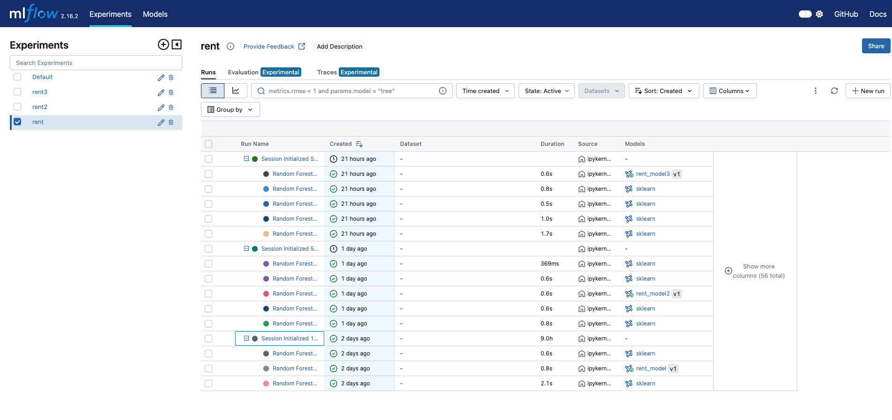

# Dmc_EMLs5_s6

API de Predicción de Alquiler con FastAPI y MLflow
Este proyecto es una API que permite realizar predicciones sobre el precio de alquiler de una propiedad utilizando un modelo de machine learning previamente entrenado y registrado en MLflow. La API está construida con FastAPI y se ejecuta en un servidor utilizando Uvicorn.

Tabla de Contenidos
Descripción
Requisitos
Estructura del Proyecto
Instalación y Configuración
Uso
Capturas de Pantalla
Créditos
Descripción
Esta API permite a los usuarios enviar datos de una propiedad, como el número de habitaciones, la ciudad y el tamaño del inmueble, y recibir una predicción del alquiler estimado. El modelo que realiza la predicción está alojado en un servidor de MLflow en estado de producción.

Tecnologías utilizadas:
FastAPI: Framework para construir la API.
MLflow: Gestión del ciclo de vida del modelo, incluyendo el registro y despliegue.
Uvicorn: Servidor ASGI para ejecutar la aplicación FastAPI.
Requisitos
Python 3.11 o superior
MLflow instalado y configurado
FastAPI
Uvicorn
Estructura del Proyecto
bash
Copiar código
/app
│   ├── app.py                  # Archivo principal de la API
│   ├── requirements.txt         # Dependencias del proyecto
│   └── Dockerfile               # Archivo Docker para contenedorización
Instalación y Configuración
Clonar el repositorio:

bash
Copiar código
git clone https://github.com/tu-repositorio/prediccion-alquiler-api.git
cd prediccion-alquiler-api
Instalar las dependencias:

Asegúrate de tener un entorno virtual activado, luego instala las dependencias:

bash
Copiar código
pip install -r requirements.txt
Configurar MLflow:

Asegúrate de tener un servidor MLflow ejecutándose y configurado. Actualiza la URI de seguimiento en el archivo app.py para que apunte a tu servidor de MLflow.

python
Copiar código
mlflow.set_tracking_uri("http://<tu-servidor-mlflow>:5000")
Correr la API localmente:

Inicia el servidor FastAPI usando Uvicorn:

bash
Copiar código
uvicorn app:app --reload
Esto levantará la API en http://127.0.0.1:8000.

Uso
Predicción de alquiler
Envía una solicitud POST a la ruta /predict con los datos de la propiedad en formato JSON, como se muestra a continuación:

json
Copiar código
{
    "BHK": 2,
    "Size": 2000,
    "Area_Type": "Super Area",
    "City": "Hyderabad",
    "Furnishing_Status": "Unfurnished",
    "Tenant_Preferred": "Bachelors",
    "Bathroom": 3,
    "Point_of_Contact": "Contact Owner"
}
Ejemplo de Respuesta:
json
Copiar código
{
    "prediction": 25000
}
Capturas de Pantalla
1. Interfaz de MLflow:

2. Interfaz de la API con FastAPI:
